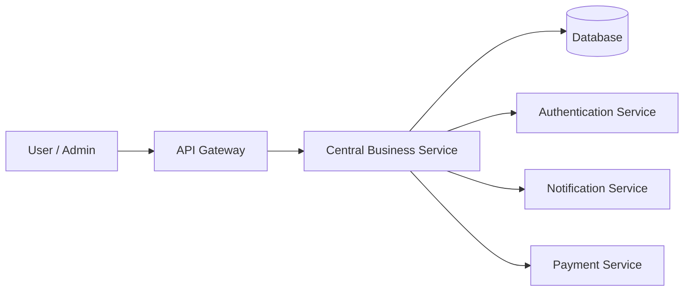

# Service Boundary của nhóm

## 1. Thông tin nhóm

- Tên nhóm: Nhóm 12
- Lớp: CNTT 17 - 09
- Thành viên: Nguyễn Trường Thịnh - Nguyễn Quang Thắng - Đỗ Mạnh Cường
- Service nhóm phụ trách: Xây dựng dịch vụ xử lý nghiệp vụ trung tâm
- Sản phẩm tổng thể của lớp: 

## 2. Actor

Ai tương tác với hệ thống/service?

- Người dùng hệ thống (User)
- Quản trị viên (Admin)
- Các service khác trong hệ thống
- API Gateway

## 3. System Boundary

Nhóm em xây phần nào?
Nhóm phụ trách xây dựng dịch vụ xử lý nghiệp vụ trung tâm để tiếp nhận, xử lý và điều phối dữ liệu giữa các service khác.

Phần nhóm kiểm soát:
- Xử lý logic nghiệp vụ chính
- Kiểm tra dữ liệu đầu vào
- Giao tiếp với Database
- Cung cấp REST API
- Xử lý phản hồi cho client/service khác
- Logging và kiểm tra trạng thái service

Phần nhóm chỉ tích hợp:
- Authentication Service
- Notification Service
- Payment Service
- API Gateway
- Frontend Client

## 4. Service Boundary

Service của nhóm có trách nhiệm gì?

- Tiếp nhận request từ người dùng hoặc service khác
- Xử lý nghiệp vụ trung tâm của hệ thống
- Điều phối dữ liệu giữa các service
- Lưu và truy xuất dữ liệu
- Trả kết quả xử lý cho client
- Kiểm tra trạng thái hoạt động của service

Service KHÔNG làm gì?
- Không xử lý giao diện người dùng
- Không quản lý đăng nhập/xác thực trực tiếp
- Không gửi email hoặc thông báo trực tiếp
- Không xử lý thanh toán độc lập
- Không quản lý frontend

## 5. Input / Output

### Input

- Request từ API Gateway
- Dữ liệu JSON từ client
- Request từ các microservice khác
- Token xác thực từ Authentication Service

### Output

- Kết quả xử lý nghiệp vụ
- Response JSON
- Thông báo trạng thái thành công/thất bại
- Dữ liệu lưu vào Database
- Response cho service khác

## 6. API dự kiến

| Method | Endpoint     | Mục đích                    |
| ------ | ------------ | --------------------------- |
| GET    | /health      | Kiểm tra trạng thái service |
| POST   | /process     | Xử lý nghiệp vụ             |
| GET    | /data        | Lấy dữ liệu                 |
| POST   | /validate    | Kiểm tra dữ liệu đầu vào    |
| PUT    | /update      | Cập nhật dữ liệu            |
| DELETE | /delete/{id} | Xóa dữ liệu                 |
| GET    | /logs        | Xem log hệ thống            |

## 7. Phụ thuộc service khác

Service này gọi đến service nào?

- Authentication Service
- Notification Service
- Payment Service
- Database Service

Service nào gọi đến service này?

- API Gateway
- Frontend Client
- Order Service
- User Service

## 8. Sơ đồ minh họa

Có thể vẽ bằng Mermaid, draw.io, Ludichart hoặc ảnh chụp sơ đồ.

